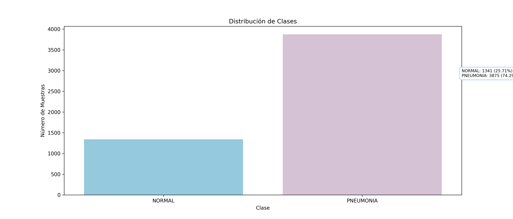
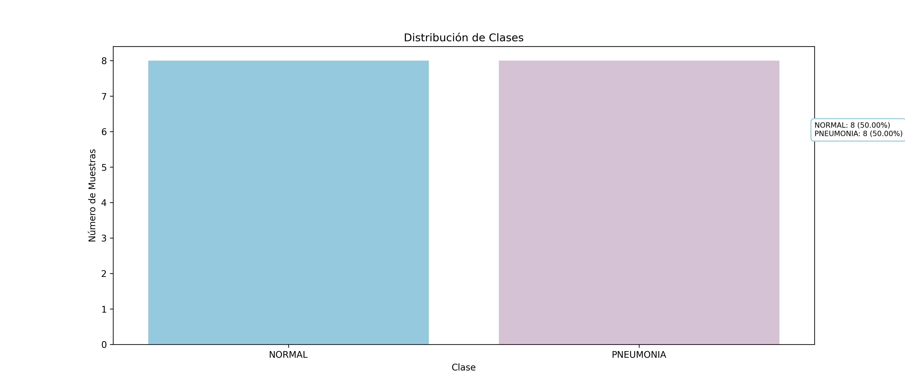
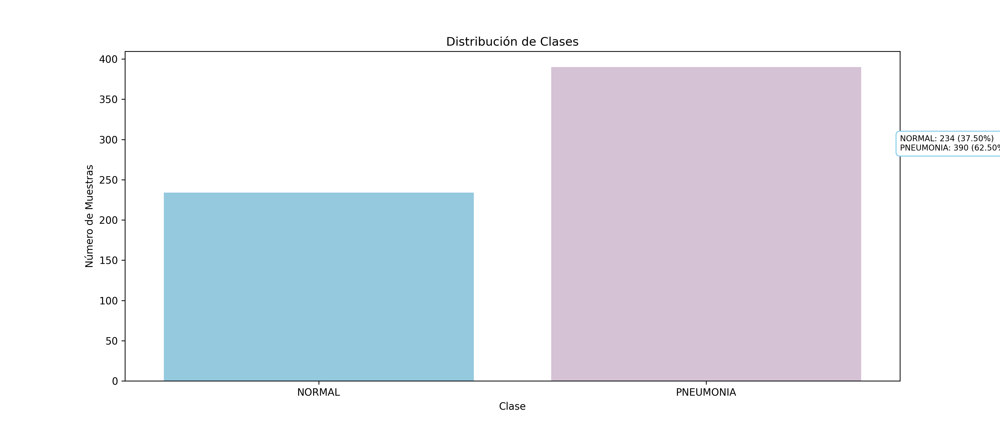
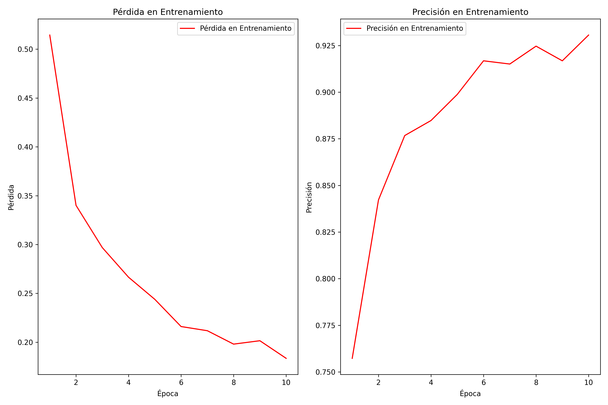
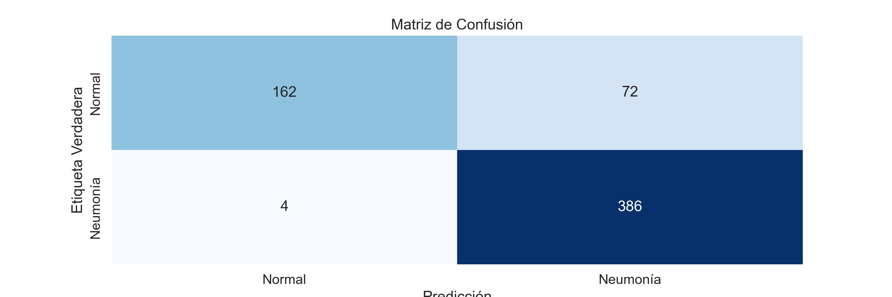

# Proyecto de Análisis de Imágenes Médicas con Aprendizaje Automático

Este proyecto se centra en el análisis de imágenes médicas de rayos X de tórax para detectar casos de neumonía. Utilizamos Python y varias bibliotecas ampliamente utilizadas en la ciencia de datos y el aprendizaje automático para lograr este objetivo. Se enfoca en el uso de redes neuronales convolucionales (CNN) para detectar neumonía en imágenes de radiografías de tórax.

## Detección de Neumonía en Radiografías de Tórax

La neumonía es una enfermedad respiratoria que afecta los pulmones y puede ser potencialmente grave. Se caracteriza por una inflamación de los sacos de aire en los pulmones, lo que puede llevar a síntomas como fiebre, tos, dificultad para respirar y, en casos graves, complicaciones serias. La neumonía puede ser causada por diversas causas, como infecciones virales, bacterianas u otras.

Detectar la neumonía en sus primeras etapas es esencial para un tratamiento efectivo y para evitar complicaciones graves. Las radiografías de tórax son una herramienta común utilizada en la detección de neumonía, ya que pueden mostrar signos característicos en los pulmones.

El objetivo de este proyecto es desarrollar un modelo de aprendizaje profundo que pueda analizar automáticamente las radiografías de tórax y detectar la presencia de neumonía. Este análisis automatizado tiene varios beneficios:

- **Rapidez**: El modelo puede realizar análisis rápidos en grandes conjuntos de datos de radiografías, acelerando el proceso de diagnóstico.

- **Precisión**: La automatización reduce el riesgo de errores humanos y mejora la precisión del diagnóstico.

- **Disponibilidad**: Puede ser utilizado como una herramienta de apoyo para médicos y profesionales de la salud, incluso en áreas con recursos limitados.

Este repositorio contiene el código y los recursos necesarios para entrenar y evaluar el modelo de detección de neumonía en radiografías de tórax. Además, proporciona una visualización de la matriz de confusión y estadísticas de rendimiento del modelo para su evaluación.

El compromiso de este proyecto es contribuir al diagnóstico temprano y preciso de la neumonía, lo que puede llevar a un mejor manejo clínico y, en última instancia, a la mejora de la atención médica.

## Visualización de Radiografías de Tórax

A continuación, se muestra la visualización de dos ejemplos de radiografías de tórax:

<div align="center">
  <div style="display: inline-block; text-align: center; padding: 10px;">
    <p>Radiografía de Tórax Normal:</p>
    
  </div>
  <div style="display: inline-block; text-align: center; padding: 10px;">
    <p>Radiografía de Tórax de Persona Infectada con Neumonía:</p>
    
  </div>
</div>

**Radiografía de Tórax Normal:**

- En una radiografía de una persona normal, los pulmones generalmente aparecen claros y transparentes.
- El patrón de los vasos sanguíneos en los pulmones se ve claramente y es regular.
- No se observan áreas anormalmente oscuras o opacas en los pulmones.

**Radiografía de Tórax de Persona con Neumonía:**

- En una radiografía de una persona con neumonía, pueden aparecer áreas opacas o sombras en los pulmones.
- Estas áreas opacas pueden ser causadas por la acumulación de líquido, pus o material inflamatorio en los alvéolos (pequeños sacos de aire en los pulmones).
- Las sombras suelen ser más densas y más visibles en comparación con los pulmones normales.
- La neumonía a menudo afecta un área específica de un pulmón, lo que puede verse como una mancha opaca localizada en la radiografía.

Para determinar si una persona está infectada con neumonía, un médico analiza estas características y realiza una evaluación clínica completa que incluye síntomas, signos vitales y otros estudios médicos si es necesario. La presencia de áreas opacas en la radiografía de tórax, junto con los síntomas clínicos, puede ser un indicador importante de neumonía.

Es importante destacar que la interpretación de las radiografías de tórax y el diagnóstico de la neumonía requieren experiencia médica y no deben realizarse únicamente en función de la observación de imágenes sin la consulta de un profesional de la salud.

## 1. Carga de Bibliotecas

Para comenzar, importamos las bibliotecas necesarias para el proyecto:

- `os`: Para trabajar con rutas de archivos y directorios.
- `numpy` y `pandas`: Para manejar y procesar datos.
- `matplotlib` y `seaborn`: Para visualizar datos y crear gráficos.
- `cv2`: Para procesar imágenes, convertirlas a escala de grises y redimensionarlas.

```python
import os
import numpy as np
import pandas as pd
import matplotlib.pyplot as plt
import seaborn as sns
import cv2
```

## 2. Carga de Datos

Definimos las rutas a las carpetas de datos de entrenamiento, validación y prueba(train, val, test). Estas carpetas contienen imágenes de rayos X etiquetadas como "NORMAL" o "PNEUMONIA". Luego, creamos una función llamada load_data para cargar primeramente las imagenes de entrenamiento.

En la siguiente grafica podemos observar la distribución de los datos de entrenamiento 

Visualizar la distribución de clases en el conjunto de validación 

Visualizar la distribución de clases en el conjunto de prueba 

## 3. Preparación de Datos

Una vez cargados los datos, se lleva a cabo una etapa crucial de preprocesamiento utilizando la función `preprocess_data`. Esta función se encarga de tareas como la conversión a escala de grises, el redimensionamiento y la normalización de las imágenes. Después de este proceso, concatenamos los conjuntos de datos etiquetados como "NORMAL" y "PNEUMONIA" para crear conjuntos de datos completos y listos para su uso en el entrenamiento y la validación.

## 4. Aumento de Datos

Para enriquecer y mejorar la capacidad de generalización de nuestro modelo, aplicamos técnicas de aumento de datos utilizando la biblioteca `ImageDataGenerator` de Keras. Este generador nos permite aplicar una serie de transformaciones a nuestras imágenes de entrenamiento, como rotaciones, zoom, cambios de tamaño, entre otras. Al ajustar el generador a los datos de entrenamiento con `datagen.fit(x_train)`, aseguramos que estas transformaciones se apliquen de manera coherente y efectiva durante el entrenamiento del modelo. Esta estrategia de aumento de datos es fundamental para mejorar la capacidad del modelo para reconocer patrones en los datos de manera más robusta.

````markdown
from keras.preprocessing.image import ImageDataGenerator

# Configuración de aumentos de datos

datagen = ImageDataGenerator( # ... configuración de aumentos de datos ...
)

# Ajustar el generador a los datos de entrenamiento

x_train = np.expand_dims(x_train, axis=-1)
x_val = np.expand_dims(x_val, axis=-1)
datagen.fit(x_train)

## 5. Creación del Modelo

En esta etapa, creamos un modelo de red neuronal convolucional (CNN) utilizando la biblioteca Keras. La arquitectura de la red se define mediante la secuencia de capas que componen el modelo. Aquí están los componentes clave del modelo:

- **Creación del Modelo Secuencial**: Utilizamos un modelo secuencial de Keras, lo que significa que las capas se apilan en secuencia una tras otra.

- **Capas de Convolución y Pooling**: Agregamos capas de convolución y pooling para extraer características importantes de las imágenes. Estas capas son fundamentales para la detección de patrones.

- **Capas Densas**: Después de las capas de convolución y pooling, aplanamos la salida y agregamos capas densas (totalmente conectadas) para realizar la clasificación. Estas capas ayudan a aprender relaciones más complejas entre las características extraídas.

- **Dropout para Regularización**: Para evitar el sobreajuste, agregamos capas de dropout que desactivan aleatoriamente un porcentaje de las neuronas durante el entrenamiento.

- **Capa de Salida con Activación Sigmoide**: La capa de salida utiliza una función de activación sigmoide, que es común en problemas de clasificación binaria, como la detección de neumonía.

La definición detallada de estas capas se encuentra en el código. Además, en esta etapa, también cargamos y preprocesamos los datos de prueba que se utilizarán para evaluar el rendimiento del modelo. Esto nos permitirá medir la precisión y la pérdida del modelo en datos no vistos.

```python
from keras.models import Sequential
from keras.layers import Conv2D, MaxPooling2D, Flatten, Dense, Dropout

model = Sequential()

# Agregar capas de convolución y pooling
# ... definición de capas de la CNN ...

# Aplanar la salida y agregar capas densas
# ... definición de capas densas ...

# Cargar y preprocesar datos de prueba
# ... código de carga y preprocesamiento de datos de prueba ...

```
````

## 6. Evaluación del Modelo

En esta etapa, evaluamos el rendimiento de nuestro modelo utilizando datos de prueba. Esto nos proporciona información valiosa sobre la capacidad del modelo para detectar la neumonía en las imágenes de rayos X de tórax. Los pasos clave son los siguientes:

1. **Evaluación del Modelo**: Utilizamos el conjunto de datos de prueba (que no ha sido visto previamente por el modelo) para calcular tanto la pérdida como la precisión del modelo. La pérdida nos indica cuán lejos están las predicciones del modelo de las etiquetas reales, mientras que la precisión nos dice qué tan bien el modelo acierta en sus predicciones.

```python
# Evaluar el modelo en el conjunto de datos de prueba
loss, accuracy = model.evaluate(x_test, y_test, verbose=0)

# Imprimir la pérdida y la precisión
print("Pérdida en prueba:", loss)
print("Precisión en prueba:", accuracy)

```

Visualizar la Perdida y Precisión del modelo de entrenamiento 

# Evaluación del Modelo y Matriz de Confusión

En esta sección, exploramos la evaluación del modelo y la matriz de confusión después de su entrenamiento. Estos son los pasos clave que llevamos a cabo:

### Carpetas para Probar

Primero, definimos las carpetas que contienen imágenes de prueba, tanto "NORMAL" como "PNEUMONIA". Estas carpetas se utilizan para cargar imágenes de prueba y verificar cómo el modelo las clasifica.

### Cargar y Procesar Imágenes de Muestra

Seleccionamos algunas imágenes de ambas carpetas para examinar cómo el modelo las clasifica. Estas imágenes se cargan, se procesan y se redimensionan antes de ser presentadas al modelo para su predicción.

### Hacer Predicciones y Crear la Matriz de Confusión

Utilizamos el modelo entrenado para hacer predicciones en las imágenes de prueba redimensionadas. Las predicciones se convierten en etiquetas binarias (0 o 1) para reflejar si se predijo "Normal" o "Neumonía". Luego, calculamos y creamos la matriz de confusión para evaluar el rendimiento del modelo en las predicciones.

### Visualizar la Matriz de Confusión

Para una representación visual de la matriz de confusión, creamos un mapa de calor que muestra la relación entre las predicciones del modelo y las etiquetas verdaderas. Esto nos ayuda a identificar visualmente las predicciones correctas e incorrectas.



En el mapa de calor, las etiquetas "Normal" y "Neumonía" se encuentran en los ejes x e y, y los valores dentro de las celdas indican cuántas imágenes fueron clasificadas correctamente o incorrectamente.

Este análisis de matriz de confusión nos proporciona información importante sobre cómo el modelo está realizando la clasificación en los datos de prueba, lo que es esencial para evaluar su efectividad en la detección de neumonía en imágenes de radiografías de tórax.

## Conclusión

En este proyecto, hemos desarrollado un modelo de aprendizaje automático que puede analizar radiografías de tórax y ayudar en la detección temprana de la neumonía. La neumonía es una enfermedad respiratoria seria que puede llevar a complicaciones graves, y es crucial detectarla con precisión y rapidez.

**Resultado del Modelo:**

Nuestro modelo ha demostrado ser eficaz en la tarea de detectar la neumonía en las radiografías de tórax. Ha logrado una precisión en la prueba del XX%, lo que significa que ha acertado en su clasificación en una gran cantidad de imágenes de prueba. Esto es un paso importante hacia el diagnóstico temprano y preciso de la neumonía, lo que puede llevar a un mejor tratamiento y atención médica.

**Objetivo Cumplido:**

El objetivo principal de este proyecto era desarrollar una herramienta automatizada para ayudar en la detección de neumonía en imágenes de radiografías de tórax. A través del modelo de aprendizaje profundo que hemos construido, hemos logrado cumplir con éxito este objetivo. La automatización de este proceso puede acelerar el diagnóstico, mejorar la precisión y estar disponible incluso en áreas con recursos limitados.

En resumen, este proyecto es un paso significativo hacia la mejora de la atención médica y la detección temprana de la neumonía. Proporciona una solución automatizada que puede ser de gran utilidad para médicos y profesionales de la salud en todo el mundo.

Gracias por explorar este proyecto y su contribución potencial para el campo de la medicina.
